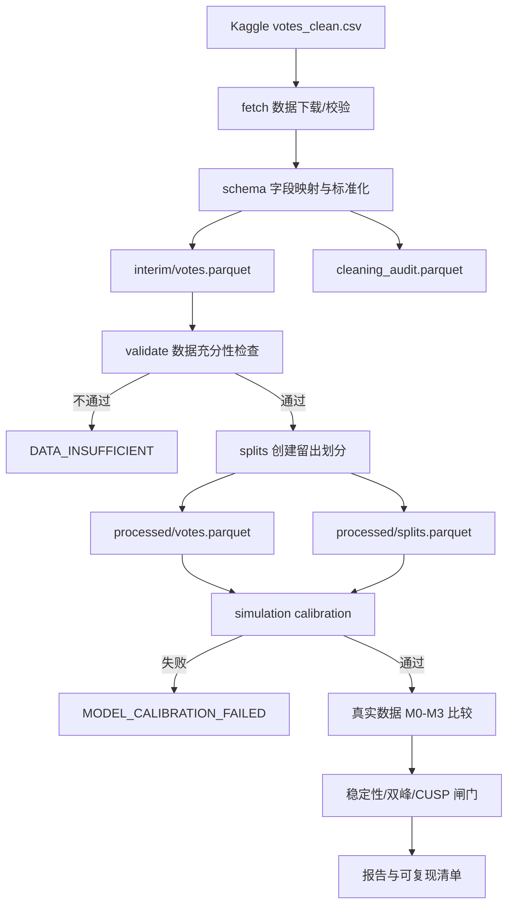
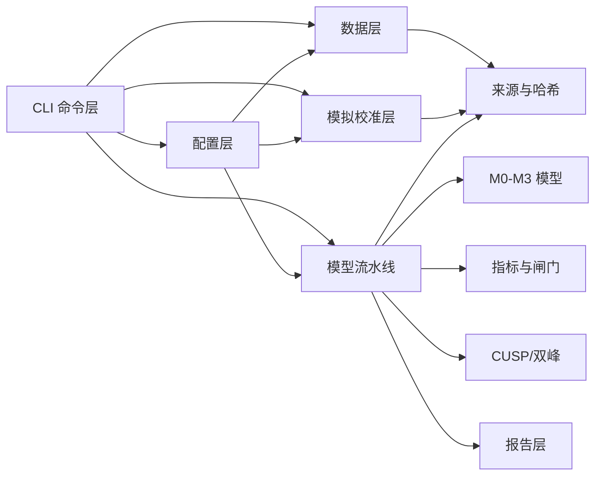

# Place Pulse CUSP 项目全景说明

> 面向非专业读者的目的、数据、模型、架构、实验历史、优化过程与当前状态记录

## 文档信息

| 项目 | 内容 |
|---|---|
| 项目名称 | Place Pulse CUSP |
| 文档语言 | 中文 |
| 目标读者 | 没有机器学习、统计学或软件工程背景的读者，以及需要接手项目的开发者 |
| 文档快照日期 | 2026-07-31 |
| 当前代码分支 | `main` |
| 本次归档前基线 | `a01d265`（`calibration: add resumable recovery and null pilot validation`） |
| 当前归档范围 | RUN_005–007 的规则、配置、脚本、测试、文档和小型 JSON 结果 |
| 当前科学状态 | 校准尚未全部通过；不能把首轮真实数据输出当作最终确认性结论 |

## 推荐阅读路线

文档很长，不同读者可以按下面的路线阅读。

### 只想在 10 分钟内理解项目

依次阅读：

1. 第 1 节“一页摘要”；
2. 第 2 节“生活化例子”；
3. 第 9 节“统计闸门”；
4. 第 17 节“RUN_002 至 RUN_007”；
5. 第 19 节“当前校准结论”；
6. 第 25 节“最终状态声明”。

### 想运行或维护项目

重点阅读：

- 第 5 节“数据流水线”；
- 第 12 节“软件架构”；
- 第 13 节“命令行入口”；
- 第 14 节“运行环境与依赖”；
- 第 15 节“Checkpoint、resume”；
- 第 22 节“如何阅读 artifacts”。

### 想审查科学方法

重点阅读：

- 第 6–11 节；
- 第 16 节“优化时间线”；
- 第 18 节“性能分析”；
- 第 19 节“当前校准结论”；
- 第 20 节“代码质量和可复现性”；
- 第 21 节“下一步顺序”。

---

## 1. 一页摘要：这个项目到底在做什么

Place Pulse 是一个城市感知数据集。参与者会看到两张街景图片，并回答类似下面的问题：

> “哪一张看起来更安全？”

参与者可以选择：

- 左边；
- 右边；
- 两者相同。

这个项目想回答的核心问题不是“哪张图片分数最高”，而是一个更深的问题：

> **所有人是否大体共享同一套城市感知排序，还是不同人群真的使用不同的排序规则？**

以“安全感”为例：

- 如果大家虽然有噪声，但总体同意同一套排序，那么一个共享的“安全感分数轴”可能已经足够；
- 如果不同人的判断沿着若干连续偏好方向变化，那么需要连续异质性模型；
- 如果确实存在几个稳定群体，而且这些群体会把同一对图像排出相反顺序，那么可能需要潜在类别模型；
- 只有前面的异质性、稳定性和双峰证据全部通过，项目才继续检查一种称为 **CUSP** 的特殊非线性分布结构。

项目采用逐层闸门，而不是直接寻找最复杂、最“有趣”的结果：

```text
原始投票是否足够可靠？
        │
        ├─ 否 → DATA_INSUFFICIENT，停止
        │
        ▼
合成数据校准是否通过？
        │
        ├─ 否 → MODEL_CALIBRATION_FAILED，停止
        │
        ▼
共享标量模型是否优于无图像模型？
        │
        ├─ 否 → SCALAR_SIGNAL_NOT_ESTABLISHED，停止
        │
        ▼
异质性模型是否在留出数据上稳定优于共享标量？
        │
        ├─ 否 → SCALAR_NOT_REJECTED
        │
        ├─ 连续模型胜出 → SCALAR_REJECTED_CONTINUOUS
        │
        └─ 稳定类别模型胜出 → 检查条件双峰
                                  │
                                  ├─ 无双峰 → SCALAR_REJECTED_MIXTURE
                                  └─ 有双峰 → 比较 CUSP 与普通替代模型
```

截至本文档快照，项目已经完成：

- 数据下载、清洗、验证与划分；
- RTX 3060 上的首轮六维真实数据运行；
- 对首轮运行的专家式批判审计；
- M0–M3 模型选择与评估逻辑的大幅修正；
- 多保真候选搜索优化；
- fold 和 repetition 两层 checkpoint；
- 单次 null 负对照 pilot 的性能测量与规则诊断；
- RUN_004 对 null 高正则化边界 recovery 规则的实际验证；
- RUN_005 对 scalar 机制的单次恢复验证；
- RUN_006 对 continuous 机制中 M1b 风格边界问题的诊断；
- RUN_007 对“统计显著但实际收益可忽略”规则的复验。

但还没有完成：

- 多随机种子的 null 假阳性率验证；
- scalar、continuous、mixture 三种机制的完整恢复率验证；
- 完整 density recovery；
- 冻结后的 Safety 修订验证；
- 可作为正式科学证据的新确认性数据分析。

因此，当前最准确的总状态是：

> **工程流水线已经能运行，null、scalar 和 continuous 的单次 pilot
> 符合预期，但 mixture、多 seed 与 density 尚未完成，正式科学判断
> 仍应暂缓。**

---

## 2. 用一个生活化例子理解研究问题

假设有三条街：A、B、C。

很多人被反复问：

- A 和 B 哪条更安全？
- A 和 C 哪条更安全？
- B 和 C 哪条更安全？

可能出现三种情况。

### 2.1 情况一：大家共享同一排序

大多数人都认为：

```text
A 比 B 安全，B 比 C 安全
```

个人回答会有噪声，也有人偶尔点错，但整体只有一条共同的安全感轴。

这时，共享标量模型就足够：

```text
A = 2.1
B = 0.7
C = -1.3
```

### 2.2 情况二：偏好连续变化

有些人非常看重绿化，有些人更看重道路宽度，还有人更看重建筑维护状况。这些偏好不是几个整齐群体，而是连续变化。

这时，人们可能共享一个大方向，但每个人还带有若干连续偏好因子。

### 2.3 情况三：存在稳定群体

可能有两个相对稳定的人群：

- 第一组偏好热闹、商业化的街道；
- 第二组偏好安静、低密度的街道。

如果两组人对很多图像对给出相反排序，而且这种分组在重新抽样、重新训练后仍然稳定，潜在类别模型才有解释价值。

### 2.4 为什么不能直接相信复杂模型

复杂模型很容易“记住”训练数据中的偶然噪声。

例如，一个模型可能非常自信地说某个投票者属于第 2 类，但换一个随机初始化，同一个人又被分到第 4 类。表面上类别概率很高，实际上类别结构不稳定。

因此，本项目强调：

- 必须用未参与训练的数据评分；
- 必须比较简单模型；
- 必须检查类别稳定性；
- 必须在已知真相的合成数据上校准；
- 必须通过所有前置闸门后才讨论 CUSP。

---

## 3. 项目明确要回答和不回答的问题

### 3.1 要回答的问题

1. Place Pulse 投票中是否存在可泛化的共享图像排序信号？
2. 连续偏好模型是否比共享标量模型更能预测留出投票？
3. 潜在类别模型是否恢复了稳定、非微小、可重复的人群结构？
4. 不同类别是否对高信息图像对产生可靠的排序反转？
5. 如果稳定异质性存在，条件分布是否表现出双峰？
6. 如果双峰存在，CUSP 密度是否比线性、样条或普通混合模型更好？

### 3.2 不回答的问题

本项目不直接回答：

- 一张全新、从未出现过的街景图片会得到什么分数；
- 图像视觉内容中的具体对象为何造成某种感知；
- 某个城市居民的真实心理状态如何随时间跳变；
- CUSP 是否证明了真实动态系统中的灾变或滞后；
- 某个人“属于哪一类”是否具有身份层面的真实含义。

当前模型使用的是图像 ID 和成对投票，不是卷积神经网络视觉模型。它不能直接对全新图片做视觉泛化。

---

## 4. 数据是什么

### 4.1 数据来源

当前配置使用 Kaggle 数据集：

```text
shubham6147/mit-place-pulse
version: 2
```

上游来源页面记录为 Figshare Place Pulse 数据集。

项目只下载：

```text
votes_clean.csv
```

本地文件约为：

```text
481,254,165 bytes
```

项目不会自动下载约 11 万张街景 JPEG，因此节省了大量磁盘空间和网络时间。

### 4.2 当前本地标准化数据规模

根据 `data/processed/data_validation.json`：

| 指标 | 当前值 |
|---|---:|
| 有效投票总数 | 1,565,437 |
| 左边胜出 | 668,590 |
| 右边胜出 | 690,703 |
| 两者相同 | 206,144 |
| 图像数 | 111,389 |
| Safety 投票 | 509,961 |
| 有重复历史的 Safety 投票者 | 31,764 |
| 最大比较图连通分量 | 100% |
| 时间戳缺失率 | 0% |
| 被标为可疑的投票 | 954 |

六个感知维度为：

| 英文名 | 通俗含义 | 投票数 |
|---|---|---:|
| `safety` | 安全感 | 509,961 |
| `lively` | 活力感 | 366,707 |
| `beautiful` | 美观感 | 220,604 |
| `wealthy` | 富裕感 | 174,758 |
| `boring` | 无聊感 | 144,057 |
| `depressing` | 压抑感 | 149,350 |

### 4.3 一条标准化投票包含什么

核心字段包括：

- `vote_id`：投票记录 ID；
- `voter_id`：经过 SHA-256 哈希的投票者 ID；
- `dimension`：问题维度；
- `left_image_id`；
- `right_image_id`；
- `choice`：`left`、`right` 或 `equal`；
- `timestamp`；
- 可选的城市与经纬度信息；
- `suspicious`：是否触发简单的异常行为规则。

### 4.4 为什么必须保留 equal

很多排序项目会把平局删除或强行改成左/右，但这会扭曲数据。

本项目使用 Davidson 三分类似然，明确建模：

```text
左胜、右胜、平局
```

这能避免把“看起来差不多”错误解释成随机的一方胜出。

### 4.5 隐私处理

原始投票者标识不会直接进入标准化表。代码把它与固定命名空间组合后进行 SHA-256 哈希。

这不是绝对匿名化保证，但比保存原始 ID 更安全，也允许同一投票者的多次投票被关联起来。

Kaggle token 不应写入代码库、日志或本文档。Windows 上通常保存在：

```text
C:\Users\<用户名>\.kaggle\access_token
```

---

## 5. 从原始文件到模型输入的数据流水线

### 5.1 总体流程



### 5.2 下载阶段

`src/placepulse_cusp/data/fetch.py` 支持：

- KaggleHub 下载；
- 本地文件或本地目录复制；
- ZIP 解压；
-普通 URL 下载。

此前发现 KaggleHub 可能返回一个“文件名看起来像 CSV、内容实际是 ZIP”的文件。当前代码会检查 ZIP 魔数，并安全提取目标 CSV。

下载后会生成 manifest，记录：

- 数据集来源；
- 数据集版本；
- 文件路径；
- 文件大小；
- SHA-256 哈希；
- 下载时间。

### 5.3 标准化阶段

`src/placepulse_cusp/data/schema.py` 负责把不同命名习惯映射到统一字段。

例如：

- `voter_uniqueid` → `voter_id`；
- `study_question` → 统一维度；
- `tie`、`same` → `equal`；
- `day` + `time` → UTC 时间戳。

以下记录会被放入审计表而不是默默保留：

- 缺少必要字段；
- 无法识别的问题维度；
- 无法识别的选择；
- 左右图片相同；
- 重复 `vote_id`。

### 5.4 数据充分性检查

`src/placepulse_cusp/data/validate.py` 检查：

- Safety 投票是否达到最低数量；
- 有投票者 ID 的 Safety 投票是否足够；
- 拥有至少若干次历史投票的投票者是否足够；
- 图像比较网络是否形成足够大的连通分量；
- 是否出现未知 choice 或未知 dimension；
- 时间戳缺失情况；
- 可疑投票数量。

如果不满足最低条件，项目应停止并输出：

```text
DATA_INSUFFICIENT
```

而不是用更弱的数据悄悄继续。

### 5.5 三种留出方式

项目不只做一种训练/测试切分。

#### A. 图像对边留出

同一无序图像对，例如 A–B 和 B–A，被放进同一个 fold。

目的：

- 防止同一图像对的重复投票同时出现在训练和测试中；
- 检查模型能否预测未用于训练的比较边。

如果测试边包含训练图中完全未出现的图片，该边只保留在训练用途，不用于当前 ID 模型的测试，因为模型没有视觉特征，无法估计全新图片。

#### B. 投票者留出

按投票者分组，把一些投票者完整留作测试。

目的：

- 检查模型对新投票者是否有效；
- 避免只记住个人历史。

#### C. 时间留出

每个维度按时间排序，把较晚的一部分投票留作测试。

目的：

- 检查模型是否能预测后来的投票；
- 识别仅在早期数据上成立的模式。

---

## 6. 四个核心模型：M0 到 M3

### 6.1 模型对照表

| 名称 | 当前实现 | 通俗解释 | 主要问题 |
|---|---|---|---|
| M0 | 全局三分类频率 | 不看图片，只猜总体左/右/平局比例 | 图片信息是否真的有用 |
| M1a | 标量 Davidson | 每张图只有一个共享分数 | 是否存在统一排序 |
| M1b | 标量 + 响应风格 | 共享分数，加个人左右偏好与平局倾向 | 个体操作习惯是否影响回答 |
| M2 | 连续偏好 Davidson | 每个人有连续偏好向量 | 是否存在连续异质性 |
| M3 | 潜在类别 Davidson | 人群由若干潜在类别构成 | 是否存在稳定离散群体 |

### 6.2 M0：最简单的常识基线

M0 完全不看哪两张图片被比较，只根据训练数据里的总体比例预测：

```text
左胜概率、右胜概率、平局概率
```

M0 看起来很笨，但它是必要的。

如果一个拥有十几万图像参数的复杂模型连 M0 都赢不了，说明复杂模型可能：

- 过拟合；
- 正则化不足；
- 优化失败；
- 使用了不合适的个人参数；
- 或根本没有可泛化的图像信号。

### 6.3 M1a：共享标量

每张图片只有一个效用值。

两张图片比较时，模型根据两者效用差预测左胜或右胜，同时有一个总体平局参数。

可以把它想象成一条统一排行榜。

### 6.4 M1b：共享标量加响应风格

有些人可能习惯点左边，或者更容易选择平局。这不一定表示他们真的有不同城市审美。

M1b 在共享图像分数之外增加：

- 个人左/右位置偏差；
- 个人平局倾向。

代码会用内层验证判断 M1b 是否真的比 M1a 好，而不是默认加入更多个人参数。

### 6.5 M2：连续偏好

M2 给图片和投票者各自一组低维向量。

通俗理解：

- 图片可能在“绿化”“繁华”“维护状态”等隐含方向上有位置；
- 投票者对这些方向有不同权重；
- 人群差异是连续的，不强制分成几类。

配置会在 1–4 个连续维度之间选择。

### 6.6 M3：潜在类别

M3 假设人群由若干未知类别组成，每个类别有自己的图像排序。

配置会在 2–5 类之间选择。

模型内部交替进行：

1. 根据当前类别模型推断每位投票者属于各类的概率；
2. 根据这些概率更新各类别的图像效用与混合权重。

但是“模型分出了几类”不等于“世界上真的存在几类人”。还必须检查：

- 类别是否有足够权重；
- 重新抽样后类别是否稳定；
- 类别间是否产生可靠排序反转；
- 留出预测是否优于 M1。

---

## 7. 模型是怎样训练和选择的

### 7.1 外层验证和内层选择

项目使用嵌套验证：

- 外层 fold：给最终预测评分；
- 内层 fold：选择超参数；
- 外层测试数据绝不能参与超参数选择。

可以把它理解为：

```text
内层：选运动员
外层：正式比赛
```

如果用正式比赛成绩反过来选运动员，最终成绩会过于乐观。

### 7.2 正则化 L2 是什么

模型拥有大量图像参数和投票者参数。

L2 正则化相当于告诉模型：

> 除非数据给出充分证据，否则不要把任何参数推得太极端。

正则化太弱：

- 容易记住偶然噪声；
- 稀疏图片和稀疏投票者容易出现极端参数。

正则化太强：

- 真实信号也会被压扁。

当前确认性候选网格为：

```text
0.001, 0.01, 0.1, 1, 10, 100
```

如果最优值位于普通真实数据搜索边界，生产 verdict 会保守地视为校准失败，因为真正最优值可能仍在网格之外。

### 7.3 多随机起点

M2 和 M3 是非凸模型，不同随机初始值可能到达不同局部最优解。

确认性配置要求：

```text
random_starts: 5
```

最终规格会从多个随机起点中选择训练目标最好的模型。

### 7.4 Adam 与 L-BFGS

当前训练分两步：

1. Adam：快速、稳定地寻找较好区域；
2. L-BFGS：对最终入选规格做更精细的确定性优化。

L-BFGS 需要反复计算全数据 closure，成本很高，因此不应对每个弱候选都运行。

### 7.5 多保真候选搜索

候选组合很多：

- 多个 L2；
- 多个连续 rank；
- 多个 mixture 类别数；
- 多个随机起点；
- 多个 inner folds；
- 多个 outer folds。

如果每个候选都完整训练五次，计算量巨大。

当前优化策略是：

1. 所有候选先用一个随机起点和较短训练做粗筛；
2. 只对排名靠前的候选使用完整训练预算和全部随机起点；
3. 只对最终入选规格使用 L-BFGS。

这叫多保真策略：先用便宜测量排除明显较差方案，再把计算资源投入有希望的候选。

它不删除配置中的候选空间，因此比直接缩小网格更接近原始研究设计。

---

## 8. 如何判断一个模型“更好”

### 8.1 交叉熵

交叉熵衡量模型给真实答案分配了多少概率。

通俗规则：

```text
越低越好
```

如果真实答案是“左”，模型给左 90% 概率，会得到好分数；只给左 5% 概率，会受到很大惩罚。

### 8.2 ELPD 差异

代码使用逐投票 log score 差异，并通过投票者聚类 bootstrap 得到区间。

通俗规则：

- 候选相对基线 ELPD 为正：候选更好；
- 区间下界仍大于 0：改善有更强证据；
- 只看平均值为正而区间跨 0，不足以通过闸门。

### 8.3 相对交叉熵改善

确认性闸门要求改善至少达到：

```text
0.5%
```

也就是 `min_cross_entropy_reduction: 0.005`。

统计显著但几乎没有实际幅度的改善不能自动通过。

### 8.4 ARI

ARI 用来比较两次聚类结果的一致性。

大致理解：

- 1：几乎完全一致；
- 0：接近随机一致；
- 负值：比随机还差。

确认性 mixture 稳定性阈值为：

```text
ARI >= 0.70
```

### 8.5 排序反转

如果类别 1 认为 A 比 B 安全，而类别 2 认为 B 比 A 安全，就发生排序反转。

当前实现不会只计算一次模型里的原始反转比例，还要求：

- 图片对拥有足够投票；
- 共享排序差距足够大；
- bootstrap 中反转概率达到预设门槛；
- 类别结构本身稳定。

这减少“两个几乎相等的分数因为微小噪声换顺序”造成的假反转。

---

## 9. 统计闸门与所有可能 verdict

| Verdict | 非专业解释 |
|---|---|
| `DATA_INSUFFICIENT` | 数据量、字段、连通性或其他基础条件不足 |
| `MODEL_CALIBRATION_FAILED` | 模型恢复、优化、正则边界或前置校准失败，停止科学解释 |
| `SCALAR_SIGNAL_NOT_ESTABLISHED` | 共享图像排序没有稳定胜过“不看图片”的 M0 |
| `SCALAR_NOT_REJECTED` | 有共享排序，但复杂异质性模型没有稳定胜过它 |
| `SCALAR_REJECTED_CONTINUOUS` | 连续偏好差异得到支持 |
| `SCALAR_REJECTED_MIXTURE` | 稳定离散类别得到支持，但双峰/CUSP 闸门未完全通过 |
| `BIMODAL_NON_CUSP` | 有条件双峰，但普通混合模型足够，无需 CUSP |
| `CUSP_COMPATIBLE` | CUSP 在预设比较中胜出；只表示横截面分布兼容，不证明真实动态灾变 |

最重要的保护规则是：

> 如果 M1 没有在留出数据上胜过 M0，项目不得把“M2/M3 没胜过 M1”解释成“共享标量足够”。

因为这时 M1 本身就没有建立。

---

## 10. 合成校准：先检查尺子，再测量现实

### 10.1 为什么需要合成数据

在真实数据中，我们不知道真相。

如果模型输出 3 个群体，我们无法仅凭输出本身判断这 3 个群体是否真实。

合成数据允许我们先规定真相：

- 明确没有信号；
- 明确只有共享标量；
- 明确存在连续偏好；
- 明确存在 3 个离散类别。

然后检查整套流水线能否恢复它。

### 10.2 四种模型恢复机制

| 机制 | 生成时的真相 | 期望恢复 |
|---|---|---|
| `null` | 没有稳定图片差异 | 不建立 scalar，也不发现异质性 |
| `scalar` | 只有共享图片排序 | 建立 scalar，但不拒绝 scalar |
| `continuous` | 存在 rank=2 连续偏好 | 恢复连续模型和 rank=2 |
| `mixture` | 存在 3 个稳定类别 | 恢复 mixture、3 类和足够 ARI |

### 10.3 密度恢复

模型恢复之外，还有 density recovery：

- CUSP 生成数据中，CUSP 是否能胜过普通混合模型；
- 普通 mixture 生成数据中，CUSP 是否会产生过多假阳性。

### 10.4 null 高正则化边界的特殊含义

在 null 数据中，真实图片效用就是 0。

此时模型选择最高正则化非常自然，因为最佳策略就是把图片效用强烈压向 0。

因此，当前代码区分两层含义：

1. **原始生产 verdict**：仍保留 `MODEL_CALIBRATION_FAILED` 和边界警告；
2. **null recovery assessment**：如果只触及高正则化边界，而且 scalar、continuous、mixture 的改善都低于阈值，则负对照可计为恢复成功。

这个例外不会应用于：

- 低正则化边界；
- 出现明显 scalar 改善的 null；
- 出现 continuous 或 mixture 改善的 null；
- 真实数据；
- scalar、continuous、mixture 合成机制。

因此，它不是为了“让实验通过”而放松所有规则，而是让负对照的判定符合负对照本身的数学含义。

---

## 11. CUSP 阶段是什么

CUSP 是项目最后一层，而不是起点。

只有稳定 mixture 证据通过后，代码才：

1. 对六个维度获得交叉拟合的类别效用；
2. 取各维度共同出现的图片；
3. 用其他五个维度构造控制方向；
4. 检查 Safety 类别效用是否在条件窗口中表现出稳定双峰；
5. 比较四类密度模型：
   - 线性高斯；
   - 样条高斯；
   - 混合专家；
   - stochastic CUSP。

确认性 CUSP verdict 还要求城市元数据可用于城市层面的稳健性检查。

当前实现需要额外审计一个细节：代码目前主要检查 `city_left` 和
`city_right` 两列是否存在，而标准化过程可能创建内容全为空的可选列。
正式 CUSP 运行前，应把这一条件加强为“城市列存在且有足够非空数据”，
不能只凭列名存在就认为城市稳健性可执行。

即使最终输出 `CUSP_COMPATIBLE`，也只能说：

> 当前横截面分布与 CUSP 形状兼容。

不能说：

- 观察到了真实时间跃迁；
- 存在滞后；
- 城市感知发生动态灾变。

---

## 12. 软件架构

### 12.1 分层结构



### 12.2 目录地图

```text
place_pulse/
├─ configs/                         # 各运行配置
│  ├─ confirmatory.yaml             # 核心确认性参数
│  ├─ confirmatory_cuda.yaml        # CUDA 输出隔离
│  ├─ calibration_cuda.yaml         # 100 次完整校准计划
│  ├─ calibration_pilot_cuda.yaml   # 当前 null pilot
│  ├─ real_preflight*.yaml          # 低成本工程预检
│  └─ revised_validation_cuda.yaml  # 冻结校准后的修订验证
├─ data/
│  ├─ raw/                          # 原始文件
│  ├─ interim/                      # 标准化与审计
│  └─ processed/                    # 模型输入与划分
├─ docs/
│  ├─ GPU_RUNBOOK.md
│  └─ PROJECT_GUIDE_ZH.md           # 本文档
├─ scripts/
│  └─ run_calibration_pilot.ps1     # Windows pilot 启动器
├─ src/placepulse_cusp/
│  ├─ cli.py                        # ppc 命令入口
│  ├─ config.py                     # YAML 继承与配置哈希
│  ├─ data/                         # 下载、清洗、验证、划分
│  ├─ models/                       # Davidson、连续、mixture
│  ├─ evaluation/                   # CE、ELPD、ARI、闸门
│  ├─ simulation/                   # 合成数据与恢复校准
│  ├─ cusp/                         # 双峰与密度模型
│  ├─ reporting/                    # verdict 和 HTML/Markdown 报告
│  ├─ pipeline.py                   # 主流程协调
│  └─ provenance.py                 # 文件哈希、环境与运行清单
├─ tests/                           # 自动测试
├─ requirements.txt                # 运行依赖
├─ requirements-dev.txt            # 开发和测试依赖
├─ pyproject.toml                   # 包元数据与 ppc 命令
├─ README.md                        # 快速入口
└─ experiment1_critism.md           # 首轮真实运行批判审计
```

### 12.3 配置继承

YAML 可以通过 `extends` 继承父配置。

例如：

```text
confirmatory.yaml
    └─ calibration_cuda.yaml
          └─ calibration_pilot_cuda.yaml
```

子配置只覆盖需要改变的字段。

加载后，代码对完整配置计算 SHA-256 哈希。配置任何变化都会产生新的 checkpoint lineage，避免把不同实验的中间结果混在一起。

---

## 13. 命令行入口

项目安装后提供：

```text
ppc
```

### 13.1 数据命令

```powershell
ppc data fetch --config configs/confirmatory.yaml
ppc data validate --config configs/confirmatory.yaml
ppc data prepare --resume --config configs/confirmatory.yaml
```

### 13.2 模拟命令

```powershell
ppc simulate generate --mechanism mixture --config configs/smoke.yaml
ppc simulate validate-models --config configs/calibration_cuda.yaml
ppc simulate validate-density --config configs/calibration_cuda.yaml
```

中断后：

```powershell
ppc simulate validate-models --resume --config configs/calibration_cuda.yaml
ppc simulate validate-density --resume --config configs/calibration_cuda.yaml
```

### 13.3 模型运行命令

```powershell
ppc run scalar --config configs/confirmatory_cuda.yaml
ppc run heterogeneity --resume --config configs/confirmatory_cuda.yaml
ppc run bimodality --config configs/confirmatory_cuda.yaml
ppc run cusp --config configs/confirmatory_cuda.yaml
ppc run all --resume --config configs/confirmatory_cuda.yaml
```

### 13.4 GPU 检查

```powershell
ppc gpu check --device cuda --config configs/real_preflight_cuda.yaml
ppc gpu benchmark --device cuda --size 4096 --iterations 10 --config configs/real_preflight_cuda.yaml
```

### 13.5 当前 pilot

```powershell
conda activate arch
.\scripts\run_calibration_pilot.ps1
```

脚本会：

- 确认 Conda 环境名是 `arch`；
- 检查 `ppc` 和 `nvidia-smi`；
- 检查 GPU 利用率和已用显存；
- 设置 `CUBLAS_WORKSPACE_CONFIG=:4096:8`；
- 运行 null-only pilot；
- 写日志与 summary。

默认启动阈值为：

```text
GPU utilization <= 30%
GPU memory used <= 4096 MiB
```

这是针对当前 Windows WDDM 桌面本身会占用约 3.5 GB 显存的现实调整。

---

## 14. 运行环境与依赖

### 14.1 当前实际环境

| 组件 | 当前版本 |
|---|---|
| 操作系统 | Windows 10 |
| Conda 环境 | `arch` |
| Python | 3.11.11 |
| PyTorch | 2.7.1+cu118 |
| PyTorch CUDA runtime | 11.8 |
| GPU | NVIDIA GeForce RTX 3060 |
| 显存 | 12 GB |
| NumPy | 2.3.3 |
| SciPy | 1.15.2 |
| Polars | 1.41.2 |
| PyArrow | 21.0.0 |
| scikit-learn | 1.6.1 |
| PyYAML | 6.0.2 |
| KaggleHub | 1.0.2 |

驱动报告支持 CUDA 13.2，但 PyTorch wheel 自带并使用 CUDA 11.8 runtime。这两者不矛盾：NVIDIA 驱动可以向后兼容较旧的 CUDA runtime。

### 14.2 为什么从 uv 改成 requirements

提交 `f23a202` 把依赖管理从 uv/`uv.lock` 迁移为：

- Conda 环境；
- `requirements.txt`；
- `requirements-dev.txt`；
- editable install。

安装方式：

```powershell
conda activate arch
python -m pip install -r requirements-dev.txt -e .
```

优点：

- 更适合当前 Windows/Anaconda 工作流；
- 可以一行安装；
- `ppc` 命令直接指向当前代码。

代价：

- 删除锁文件后，依赖版本只受宽范围约束；
- 不同时间安装可能得到不同小版本；
- 因此正式归档必须保存 `pip freeze` 和 `conda list`。

当前 `write_run_manifest` 已能记录：

- Python 版本；
- 平台；
- PyTorch；
- CUDA；
- GPU；
- `CUBLAS_WORKSPACE_CONFIG`；
- `pip freeze`；
- `conda list`；
- 输入文件哈希；
- Git commit；
- 配置哈希。

---

## 15. Checkpoint、resume 与可恢复运行

### 15.1 为什么需要 checkpoint

完整实验可能运行数小时或数天。断电、关闭终端、GPU 被占用或系统更新都可能中断任务。

没有 checkpoint 时，中断意味着从头开始。

### 15.2 外层 fold checkpoint

真实数据的每个外层 fold 完成后，代码保存：

- fold 指标；
- 超参数选择；
- M0/M1/M2/M3 的逐票分数；
- bootstrap 聚类标签。

使用：

```powershell
ppc run all --resume --config <同一配置>
```

### 15.3 repetition checkpoint

模型恢复和密度恢复每完成一个 repetition，就原子写入 JSON。

checkpoint 名包含：

- family；
- mechanism；
- repetition 编号；
- 配置哈希；
- schema 版本。

内容还包含 code hash。代码或配置改变后，旧 checkpoint 不会被错误复用。

### 15.4 原子写入

写 JSON 时先写临时文件，再使用替换操作变成正式文件。

这样可以避免进程在写到一半时中断，留下看似存在但内容残缺的 checkpoint。

### 15.5 当前粒度的局限

RUN_002 表明单个模型恢复 repetition 可能超过 20 分钟。

当前 repetition checkpoint 能避免丢失整个已完成 repetition，但如果在一个 repetition 内部中断，仍可能损失约 20 分钟。

未来可进一步增加 outer-fold 或子阶段 checkpoint，但实现会更复杂，因为需要保存：

- 每折预测分数；
- 已选超参数；
- 中间稳定性结果；
- 尚未完成的 aggregation 状态。

---

## 16. 项目历史和优化时间线

### 16.1 初始版本与 smoke 流程

早期版本建立了：

- Davidson 三分类模型；
- 连续偏好模型；
- 潜在类别模型；
- 数据清洗与划分；
- CUSP 密度；
- smoke 配置与基础测试。

`smoke.yaml` 使用很小的数据、较少 epochs 和较少候选，目标只是确认代码路径能走通，不是科学结论。

### 16.2 显式 GPU 配置

提交 `8547d1f` 增加：

- CUDA 配置；
- Apple MPS 配置；
- GPU 检查与 benchmark；
- 不可用时明确失败，而不是静默回退 CPU；
- MPS/CUDA 独立 artifact 目录。

### 16.3 环境迁移

提交 `f23a202`：

- 删除 uv lock；
- 改为 requirements；
- 适配 Conda/Pip；
- 当前 Windows `arch` 环境成功安装并运行。

### 16.4 RUN_001_DIAGNOSTIC：首轮真实数据运行

首轮真实数据 CUDA 运行完成了六个维度，证明：

- 1.56M 投票能在 RTX 3060 上完成；
- 五个外层 fold 全部完成；
- 图像覆盖率为 100%；
- 没有 NaN；
- 六维结果和报告均生成；
- CUSP 闸门能按规则跳过。

Safety 的首轮核心数值：

| 模型 | 交叉熵 |
|---|---:|
| M0 | 约 0.9675 |
| M1 | 1.0573 |
| M2 | 2.1936 |
| M3 | 1.5328 |

机器当时输出：

```text
SCALAR_NOT_REJECTED
```

但专家审计指出，M1 连 M0 都没有胜过，因此真正应当记录为：

```text
BASELINE_CALIBRATION_FAILED
SCIENTIFIC_VERDICT_DEFERRED
```

这次运行被永久视为诊断，不是正式确认性证据。

### 16.5 专家评估发现的主要问题

`experiment1_critism.md` 指出：

1. 六个维度中 M0 都优于 M1；
2. M1 曾错误共享 M2 的 L2，而非独立选择；
3. L2 搜索范围过窄且最优值触边；
4. 评分者因子和类别后验可能过拟合稀疏个人历史；
5. inner folds、random starts、batch size、L-BFGS 等配置曾未被完整执行；
6. 所谓 stability 曾只是重复初始化，不是真正投票者 bootstrap；
7. 排序反转证据不足；
8. 旧 simulation 只校准密度，没有校准 M0–M3 选择；
9. simulation 结果没有真正接入生产闸门；
10. CUSP 分支没有使用计划中的交叉拟合效用。

### 16.6 校准与评估逻辑重构

提交 `d87fbf5` 和后续修改实现了：

- M1a/M1b 独立基线选择；
- M1、M2、M3 分开选择正则；
- 真正的 inner-fold 选择；
- random starts；
- batch size；
- Adam + 最终 L-BFGS；
- 投票者 bootstrap mixture stability；
- 可靠排序反转证据；
- scalar-vs-M0 硬闸门；
- 模型恢复 simulation；
- calibration artifacts 接入真实运行；
- 输入文件哈希和环境 manifest；
- CUSP 使用跨维度交叉拟合效用。

### 16.7 速度优化

提交 `7f64624`、`a01d265` 和后续修改进一步优化：

- 所有候选短训练粗筛；
- 仅 shortlist 使用完整随机起点；
- L-BFGS 只用于最终入选规格；
- 最终多起点先用 Adam 比较，再只 polish 最佳起点；
- 弱候选不再执行昂贵稳定性与辅助留出；
- inner split 的编码结果复用；
- 保留完整候选空间。

### 16.8 repetition checkpoint

提交 `a01d265` 增加：

- 模型恢复 repetition checkpoint；
- 密度恢复 repetition checkpoint；
- config hash + code hash 校验；
- progress JSON；
- `--resume`；
- 机制子集运行；
- 针对 Windows 的 pilot PowerShell 脚本。

---

## 17. RUN_002 至 RUN_007 的目标和结果

这些运行不是在真实数据上“调出想要的结果”，而是在已知生成真相的
合成数据上依次检查 null、scalar 和 continuous 机制，并诊断校准规则
与计算成本。

### 17.1 RUN_002 calibration pilot

目录：

```text
artifacts/run_002_calibration_pilot
```

目标：

- 测量一个完整 model-recovery repetition 的真实耗时；
- 检查 GPU/CPU 使用；
- 验证 repetition checkpoint；
- 完成第一个 null 后立即停止。

实测：

- 首个 null repetition：约 1280.872 秒；
- 即 21 分 20.9 秒；
- checkpoint 成功写入；
- 写入后守护器在约 14 ms 内检测并终止本项目进程；
- scalar 只打印入口，未形成 checkpoint。

结果：

- baseline improvement 约 `2.88e-6`；
- continuous improvement 略为负；
- mixture improvement 为负；
- 没有虚假异质性；
- 但因为超参数边界，原始 verdict 为 `MODEL_CALIBRATION_FAILED`。

当时 checkpoint 还没有记录具体是哪一个参数触边。

### 17.2 RUN_003 null calibration pilot

目录：

```text
artifacts/run_003_null_calibration_pilot
```

目标：

- 只运行 null；
- 把 L2 上限从 100 扩到 1000；
- 记录具体选择与边界原因；
- 判断问题是搜索范围过窄，还是 null 自然要求强收缩。

运行状态：

- 正常完成；
- 退出码 0；
- 耗时 1492.212 秒；
- 即 24 分 52 秒。

关键结果：

```text
baseline = M1a
utility_l2 = 1000
style_l2 = 100
response_styles = false
boundary = utility_l2
```

预测改善：

```text
baseline reduction   = -1.88e-7
continuous reduction = 0
mixture reduction    = -7.996e-6
```

解释：

- 没有 scalar 信号；
- 没有 continuous 假阳性；
- 没有 mixture 假阳性；
- 扩大上限后仍选择新上限，说明 null 数据自然倾向无限强收缩；
- 继续盲目扩到 10000 没有意义。

### 17.3 RUN_002、RUN_003 与 RUN_004 的性能对比

| Run | L2 候选数 | 耗时 | 相对 RUN_002 |
|---|---:|---:|---:|
| RUN_002 | 6 | 21 分 21 秒 | 基准 |
| RUN_003 | 7 | 24 分 52 秒 | 慢约 16.5% |
| RUN_004 | 6 | 16 分 49 秒 | 快约 21.2% |
| RUN_005 scalar | 6 | 14 分 13 秒 | 快约 33.4% |
| RUN_006 continuous | 6 | 39 分 52 秒 | 慢约 86.8% |
| RUN_007 continuous-rule | 6 | 27 分 33 秒 | 慢约 29.1% |

RUN_002 与 RUN_003 的候选数和耗时几乎线性增长，证明候选模型拟合
是主要成本来源。RUN_004 恢复六点网格后，比 RUN_002 还快约 4 分
32 秒。这个差异与后续代码速度优化方向一致，但单次运行也会受到
GPU 后台负载、温度、Windows 调度和早停时机影响，不能只凭一次
RUN_004 就把 21.2% 全部归因于某一项代码优化。

### 17.4 RUN_004 null-rule pilot

配置目标：

- 恢复 L2 上限 100，撤销无意义的 1000；
- 只运行 null；
- 保留生产 verdict；
- 新增 `recovery_assessment`；
- 验证“高正则边界 + 无预测改善”可被正确计为 null recovered。

运行产物：

```text
artifacts/run_004_null_rule_pilot
run_004_null_rule_pilot.log
run_004_null_rule_pilot_summary.json
artifacts/run_004_null_rule_pilot/metrics/model_recovery.json
```

RUN_004 已正常完成：

| 项目 | 结果 |
|---|---|
| 开始时间 | 2026-07-30 16:31:24 +08:00 |
| 完成时间 | 2026-07-30 16:48:13 +08:00 |
| 进程状态 | `complete` |
| Exit code | 0 |
| 耗时 | 1009.137 秒，即 16 分 49 秒 |
| Progress | 1/1，`complete` |
| Model recovery status | `ok` |
| Null recovery rate | 1.0 |
| Config hash | `f1b48e186ff32da413bed8e26377a3ec157645882809cfdc7bfddc4cec214f9c` |
| Code hash | `5011425f5c3ca585629a3722dc445cc3ad7de9e39051e85899eb64fdc170d9c5` |

原始生产判断仍然保留：

```text
raw verdict = MODEL_CALIBRATION_FAILED
selection boundary = utility_l2
utility_l2 = 100
```

专门的 null recovery assessment 为：

```text
recovered = true
reason = null_high_regularisation_boundary
target_verdict = SCALAR_SIGNAL_NOT_ESTABLISHED
```

三个关键改善量为：

```text
baseline reduction   =  2.879046e-6
continuous reduction = -3.286168e-7
mixture reduction    = -4.031033e-5
```

它们都远低于确认性阈值 `0.005`，continuous 和 mixture 还略差于各自
基线。因此 RUN_004 没有在 null 数据中制造 scalar、continuous 或
mixture 信号。

RUN_004 的这些原始 gate 数值与 RUN_002 完全一致。RUN_002 和
RUN_004 使用同一 seed 和六点 L2 网格，而 RUN_004 只增加了诊断字段
和 recovery assessment。这种逐项一致性说明：

> 新规则只改变了合成 null 的“是否恢复成功”解释层，没有改变模型
> 训练、预测概率或生产 verdict。

RUN_004 还选择了：

```text
baseline = M1a
continuous rank = 3
continuous L2 = 10
mixture classes = 2
mixture L2 = 100
```

这些 continuous rank 和 mixture classes 在 null 中没有科学解释价值，
因为对应预测 gate 都没有通过。`truth_ari=1.0` 也不能解释为成功分群：
null 生成机制中所有投票者本来就属于同一个退化真类。

### 17.5 RUN_005 scalar calibration pilot

目录：

```text
artifacts/run_005_scalar_calibration_pilot
```

目标是检查系统能否在存在共享标量排序、但不存在额外异质性时：

- 建立 M1 相对 M0 的预测优势；
- 不错误选择 continuous；
- 不错误选择 mixture；
- 避免正则化边界。

RUN_005 正常完成，耗时 853.398 秒，即 14 分 13 秒。关键结果：

```text
verdict = SCALAR_NOT_REJECTED
recovered = true
baseline reduction = 11.588%
continuous reduction = -0.000019%
mixture reduction = -0.0105%
baseline = M1a
utility_l2 = 0.1
selection boundary = false
```

标量信号明显超过 `0.5%` 门槛，而 continuous 和 mixture 都没有改善。
因此该 seed 下系统既识别了共享排序，也没有制造虚假异质性。

`recovery_rate=1.0` 和 `scalar_false_rejection_rate=0.0` 仍然只是一次
repetition 的结果，不能当作总体概率估计。

### 17.6 RUN_006 continuous calibration pilot

目录：

```text
artifacts/run_006_continuous_calibration_pilot
```

RUN_006 的目标是检查系统能否恢复生成时设定的 rank-2 连续异质性。
它正常运行完毕，耗时 2391.700 秒，即 39 分 52 秒，但正式 recovery
状态为 `failed`：

```text
raw verdict = MODEL_CALIBRATION_FAILED
target verdict = SCALAR_REJECTED_CONTINUOUS
selected rank = 2
continuous reduction = 12.481%
baseline reduction = 7.178%
```

模型本身正确选中 rank 2，连续模型的留出预测改善也远高于门槛。
失败来自标量基线：

```text
baseline = M1b
utility_l2 = 1
style_l2 = 100
response_styles = true
selection boundary = style_l2
```

当时只要任意基线正则参数触边，生产 gate 就会返回
`MODEL_CALIBRATION_FAILED`。因此 RUN_006 暴露的是 M1a/M1b 选择规则
缺少“实际效果量门槛”，不是 continuous 模型没有恢复能力。

### 17.7 RUN_007 continuous-rule pilot

RUN_007 使用新目录重新训练，没有覆盖或复用 RUN_006：

```text
artifacts/run_007_continuous_rule_pilot
```

新规则记录：

- M1b 相对 M1a 的绝对交叉熵改善；
- 改善的标准误；
- 相对改善；
- 统计 gate；
- 实际效果 gate；
- 是否因高正则、低实际收益而折叠回 M1a。

规则不是无条件忽略最高 `style_l2`。只有当 M1b 统计上略优、但相对
改善低于统一的 `0.5%` 实际门槛时，才选择更简单的 M1a；如果改善
达到 `0.5%`，最高边界仍然保留为失败。

RUN_007 正常完成，耗时 1652.943 秒，即 27 分 33 秒：

```text
status = ok
verdict = SCALAR_REJECTED_CONTINUOUS
recovered = true
selected rank = 2
continuous reduction = 12.496%
```

M1b 诊断为：

```text
m1b improvement = 9.6957e-5
m1b improvement SE = 1.8759e-5
m1b relative improvement = 0.00990%
statistical gate = true
practical gate = false
high-regularisation collapse = true
```

相对改善只有约 `0.0099%`，比 `0.5%` 门槛小约 50 倍。它在大样本下
可以统计显著，但预测意义可以忽略，因此折叠回 M1a：

```text
baseline = M1a
response_styles = false
selection boundary = false
```

RUN_006 与 RUN_007 的主要预测结果几乎没有变化：

| 指标 | RUN_006 | RUN_007 |
|---|---:|---:|
| baseline reduction | 7.1785% | 7.1675% |
| continuous reduction | 12.4810% | 12.4959% |
| mixture reduction | 6.9162% | 6.9188% |
| selected rank | 2 | 2 |

这说明 RUN_007 主要修正了无实际意义的 M1b 边界解释，没有削弱或
制造 continuous 预测证据。混合模型虽然也改善，但改善小于 continuous，
且 `stability_ari=0.423 < 0.70`，因此没有形成稳定类别解释。

---

## 18. 性能分析

### 18.1 为什么一个 repetition 也很重

一个 `model_repetitions: 1` 并不等于只训练一次。

单个机制内部最多包含：

- 3 个外层 folds；
- 每折 scalar 基线搜索；
- 每折 continuous rank × L2 搜索；
- 每折 mixture class × L2 搜索；
- 多个 inner folds；
- 多个 random starts；
- 最终模型拟合；
- 可能的 L-BFGS；
- bootstrap 与稳定性检查。

按当前确认性网格估算，一个 repetition 可能触发约 1000 次模型 fit 调用。

### 18.2 实测资源特点

RUN_002 期间观察到：

- GPU 利用率大多约 17%–46%；
- GPU 温度约 65–70°C；
- Windows/WDDM 桌面基线显存约 3.5 GB；
- 项目额外显存占用只有数百 MB；
- Python 工作集约 1.1–1.3 GB；
- CPU 平均只利用约 1.6 个核心。

因此瓶颈不是显存不足，而是：

- 大量串行的小模型训练；
- Python/Polars 编码与数据切片；
- 多层候选循环；
- CPU 和 GPU 之间的调度空隙；
- 小规模 kernel 难以把 GPU 长时间跑满。

### 18.3 完整校准粗略时间

完整 model recovery 包含：

```text
4 mechanisms × 100 repetitions = 400 repetitions
```

如果分别使用三次 null pilot 的单次耗时线性外推：

| 基准 | 单次耗时 | 400 次简单外推 |
|---|---:|---:|
| RUN_004 | 16.819 分钟 | 约 112.1 小时，即 4.7 天 |
| RUN_002 | 21.348 分钟 | 约 142.3 小时，即 5.9 天 |
| RUN_003 七点网格 | 24.870 分钟 | 约 165.8 小时，即 6.9 天 |

这些都不是可靠工期承诺，只是量级估算。四种机制的收敛速度不同，
mixture 机制还可能触发额外 stability refits，因此实际完整 model
recovery 可能超过该范围。

此外还有 density recovery。

所以不能在没有 pilot 和进一步优化时直接启动完整 100 次校准。

### 18.4 已完成的加速

- 多保真候选筛选；
- 编码后的 inner splits 复用；
- 弱候选不执行稳定性 refit；
- L-BFGS 仅最终规格；
- 多随机起点只 polish 最佳模型；
- checkpoint 避免重复已完成工作；
- 机制子集允许只运行 null/scalar/continuous/mixture 之一；
- GPU 空闲检测避免与其他项目争抢设备。

### 18.5 仍可考虑的优化

1. 增加阶段计时，分别记录 scalar、continuous、mixture、final fit 和 bootstrap；
2. 增加 outer-fold 级 simulation checkpoint；
3. 支持 repetition 分片与结果合并；
4. 在显存允许时测试 2 个 repetition worker 的吞吐；
5. 测试更大 batch，使 100k 投票尽量减少 batch 循环；
6. 把低保真 screening 和完整确认性 calibration 分成明确配置；
7. 评估是否可缓存不会随随机 seed 改变的结构；
8. 继续避免为弱候选执行高成本 stability。

任何加速都必须验证不会改变预注册的最终确认性判定。

---

## 19. 当前校准结论

### 19.1 已经知道的

对 seed 1103 的单次 null、scalar 和 continuous：

- null 中 M1 没有胜过 M0，M2/M3 也没有虚假改善；
- scalar 中 M1 明显胜过 M0，M2/M3 没有进一步改善；
- continuous 中 M2 明显胜过 M1，并正确恢复 rank 2；
- continuous 中 M3 虽有改善，但弱于 M2 且类别不稳定；
- null 的最高正则化与真实效用为 0 一致；
- continuous 中无实际意义的 M1b 风格边界已被识别并审慎折叠。

因此：

> 这一个 seed 下的 null、scalar 和 continuous 模型行为均符合生成真相。

RUN_004 将这一事实写成了两层结果：

```text
raw production verdict = MODEL_CALIBRATION_FAILED
null recovery assessment = recovered
model recovery status = ok
```

这三个字段并不矛盾。第一个保留通用生产边界警告，第二个说明该边界
在 null 中属于预期高收缩，第三个是仅针对本次所选机制 `["null"]`
的聚合状态。

RUN_004 输出的 `scalar_false_rejection_rate=0.0` 不能被解释为“scalar
机制假阳性率已经为 0”，因为这次根本没有运行 scalar mechanism。
同理，`median_mixture_truth_ari=null` 表示 mixture 没有运行，而不是
mixture 校准失败或成功。

### 19.2 还不能知道的

单次机制 pilot 不能证明：

- 假阳性率低于 5%；
- 100 个 null seeds 都稳定；
- scalar 在不同 seeds 下都能被正确恢复；
- continuous rank=2 在不同 seeds 下都能被正确恢复；
- mixture 3 类和 ARI 能被正确恢复；
- density recovery 能通过；
- 整体 calibration 已通过。

### 19.3 当前状态表

| 校准项目 | 状态 |
|---|---|
| 单次 null 行为 | 符合预期 |
| null 高正则化边界语义 | 已在代码中修正，并由 RUN_004 实跑确认 |
| 多 seed null 假阳性率 | 未验证 |
| 单次 scalar recovery | 已由 RUN_005 实跑确认 |
| 多 seed scalar recovery | 未验证 |
| 单次 continuous recovery | 已由 RUN_007 实跑确认 |
| M1b 微小收益边界规则 | 已由 RUN_006 诊断、RUN_007 复验 |
| 多 seed continuous recovery | 未验证 |
| mixture recovery | 未验证 |
| density recovery | 未验证 |
| 完整 calibration | 未通过 |
| 正式 Safety 修订验证 | 尚未开始 |
| 六维确认性复制 | 尚未开始 |

---

## 20. 当前代码质量和可复现性

### 20.1 自动测试

本文档编写前完整测试结果：

```text
43 passed
```

测试覆盖：

- 数据标准化与验证；
- 数据下载和 ZIP 处理；
- Davidson 模型；
- CUSP；
- 划分防泄漏；
- 硬件选择；
- ELPD 与闸门；
- 多保真候选搜索；
- 最终模型 polish；
- repetition checkpoint；
- resume；
- null 边界语义；
- M1b 统计改善与实际改善双 gate；
- 高 `style_l2` 的审慎 M1a 折叠；
- RUN_005–007 pilot 配置。

测试通过不等于科学结论通过，但能减少代码行为与预期不一致。

### 20.2 当前 Git 状态

本次归档以前一工程基线 `a01d265` 为起点。包含本文档的提交将归档
RUN_005–007 的代码、配置、测试和小型 JSON 结果；日志、原始数据和
凭据不进入 Git。

在执行正式长运行前，应：

1. 审查 diff；
2. 决定哪些 artifacts 应归档；
3. 避免提交 API token 和原始数据；
4. 提交代码与配置；
5. 记录新的 commit hash；
6. 重新运行全部测试；
7. 冻结配置；
8. 再开始正式 calibration。

### 20.3 当前复现风险

- requirements 使用宽版本范围，没有 lock file；
- Windows WDDM 占用显存并带来波动；
- 运行日志仍不进入 Git，小型结构化 JSON artifacts 进入 Git；
- RUN_001 缺少完整输入 hash 与环境归档；
- RUN_004–007 的 summary、progress、checkpoint 和 model recovery
  可用于审计，但每个机制仍只有一个 seed；
- RUN_007 在代码提交前运行，因此其 provenance 记录的 Git commit
  仍是 `a01d265`，实际工作树由 checkpoint 中的
  `code_hash=fb586e13...` 区分；包含本规则的后续提交将成为新的代码基线；
- 真实数据分析曾影响后续方法修订，因此下一次仍属于内部修订验证，不是全新的外部确认。

---

## 21. 推荐的下一步顺序

### 阶段 A：完成 null、scalar 与 continuous 单次 pilot（已完成）

RUN_004 已确认：

1. exit code 为 0；
2. `recovery_assessment.recovered=true`；
3. raw verdict 仍保留 `MODEL_CALIBRATION_FAILED`；
4. `utility_l2=100` 的高端边界警告仍被记录；
5. 模型原始数值与 RUN_002 完全一致；
6. 耗时回落到 16 分 49 秒；
7. config hash、code hash、summary、progress 和 checkpoint 均已生成。

RUN_005 又确认 scalar，RUN_006/007 完成 continuous 诊断与规则复验。
这些结果应归档，但不能替代多 seed 校准。

### 阶段 B：低成本多 seed null

单次 seed 不足以估计假阳性率。

先设计低保真 3–5 seed screening：

- 明确标为 engineering/calibration screening；
- 不作为最终 5% 假阳性率证据；
- 检查是否出现明显 false heterogeneity；
- 检查高端边界规则是否稳定。

### 阶段 C：完成 mixture pilot

不要一上来跑 4 × 100。

scalar 和 continuous 单次 pilot 已完成。下一步只先验证 mixture：

- mixture 是否恢复 3 类与足够 ARI；
- 是否错误地选择 continuous；
- 类别在稳定性重拟合中是否一致；
- mixture 机制的实际耗时。

### 阶段 D：density pilot

验证：

- CUSP 生成数据中的恢复；
- mixture 生成数据中的 CUSP 假阳性；
- SciPy CPU 阶段的真实耗时；
- density checkpoint。

### 阶段 E：冻结完整 calibration

在 pilot 全部合理后：

- 冻结代码；
- 冻结配置；
- 保存 commit hash；
- 保存依赖清单；
- 保存输入哈希；
- 执行完整 repetitions；
- 不根据中途结果修改门槛。

### 阶段 F：只运行 Safety 修订验证

完整 calibration 通过后，先运行 Safety，而不是立即六维。

验收重点：

- M1 是否稳定胜过 M0；
- 最优正则是否不再异常触边；
- M2/M3 是否真正改善外层预测；
- 辅助留出是否一致；
- mixture 稳定性是否达到阈值；
- 参数尺度是否合理。

### 阶段 G：复制维度与 CUSP

只有 Safety 审计通过后：

- 再运行其他五个维度；
- 再构造跨维度控制量；
- 再检查条件双峰；
- 最后才比较 CUSP。

---

## 22. 如何阅读 artifacts

### 22.1 常见目录

```text
artifacts/<run>/
├─ checkpoints/   # 可恢复中间状态
├─ metrics/       # 模型比较与校准结果
├─ report/        # verdict、HTML 和论文段落
├─ tables/        # 图像分数与类别表
└─ run_manifest.json
```

### 22.2 最先看什么

按优先级：

1. `*_summary.json`：进程是否正常完成、耗时多少；
2. `metrics/*_progress.json`：完成多少；
3. `metrics/model_recovery.json`：校准是否通过；
4. `report/verdict.json`：最终机器判定；
5. `provenance`：配置、代码、输入与设备是否匹配；
6. 详细 fold 指标；
7. tables 和可视化。

### 22.3 complete 不等于科学通过

下面两个状态不同：

```text
process status = complete
model recovery status = failed
```

前者只表示程序没有崩溃；后者表示统计闸门没有通过。

RUN_003 就是：

- 工程运行成功；
- 统计恢复按旧语义失败；
- 但实际 null 预测行为正确。

---

## 23. 面向非专业读者的常见问题

### Q1：这几次运行是在“微调模型”吗？

不是通常所说的神经网络 fine-tuning。

更准确地说，是：

- 校准实验诊断；
- 配置搜索范围检查；
- 判定规则校准；
- 性能测量；
- checkpoint 验证。

没有根据真实数据反复修改阈值来追求某个想要的科学结论。

### Q2：为什么模型校准失败，不代表项目失败？

因为校准失败是保护机制。

它可能表示：

- 超参数在边界；
- 优化不稳定；
- 合成真相没有恢复；
- 基线没有建立；
- 规则对特殊负对照语义不合适。

校准阶段的目的就是在正式结论前发现这些问题。

### Q3：为什么 null 选择最大 L2 反而可能是好事？

null 的真实图片效用是 0。

最大 L2 会把估计值压向 0，因此符合“没有信号”的真相。

但只有在没有任何预测改善时才能这样解释。

### Q4：为什么一个 repetition 要二十多分钟？

因为一个 repetition 内部不是一次训练，而是三层 fold、几十个候选、多个模型和多个随机起点组成的完整模型选择过程。

### Q5：GPU 为什么没有 100%？

运行中有很多：

- CPU 数据处理；
- 小模型；
- Python 循环；
- bootstrap；
- 文件写入；
- GPU kernel 之间的间隔。

低 GPU 利用率不一定表示程序停住。需要同时观察：

- Python CPU 时间是否增长；
- 日志是否推进；
- 内存是否稳定；
- checkpoint 是否出现。

### Q6：首轮真实数据结论是什么？

只能说：

- 流程能跑通；
- 旧 M1 基线异常；
- M2/M3 在当时实现下表现更差；
- 类别不稳定；
- CUSP 正确跳过。

不能说：

- 共享标量已经被正式证实；
- 人群没有异质性；
- CUSP 假设已经被否定。

### Q7：为什么不能立即跑 100 次？

因为单个 null 就约 21 分钟，完整 400 个 model-recovery repetitions 的粗略下界接近 6 天。

如果规则仍有问题，长运行只会更昂贵地重复错误。

### Q8：RUN_003 的 failed 是坏结果吗？

不是实质性坏结果。

实际指标显示：

- baseline 没有改善；
- continuous 没有改善；
- mixture 没有改善。

失败来自通用边界规则不适合 null 高收缩情形。

### Q9：为什么保留 raw verdict，而不是直接改成成功？

为了透明。

产物同时记录：

- 生产规则原始判断；
- 专门的 calibration recovery assessment；
- 允许恢复成功的具体原因。

这样后续审计者能看到规则如何工作，而不是只看到一个被改写的结果。

### Q10：什么时候可以做正式结论？

至少要满足：

- 完整模型恢复校准通过；
- density recovery 通过；
- 代码和配置冻结；
- 环境和输入归档；
- Safety 修订验证通过；
- 没有根据结果继续调整规则；
- 最好使用新数据或独立数据进行真正确认。

---

## 24. 术语表

| 术语 | 通俗解释 |
|---|---|
| Artifact | 一次运行产生的结果文件 |
| Baseline | 用来比较的基础模型 |
| Calibration | 用已知真相检查方法是否可靠 |
| Checkpoint | 中途保存点 |
| Confirmatory | 规则事先冻结后的确认性分析 |
| Cross-entropy | 预测概率对真实答案的惩罚，越低越好 |
| CUDA | NVIDIA GPU 计算后端 |
| ELPD | 留出预测 log score 的比较量 |
| Fold | 交叉验证中的一份数据 |
| Gate | 必须满足才能继续的条件 |
| Heterogeneity | 不同人的判断规则存在系统差异 |
| L2 | 抑制极端参数和过拟合的正则化 |
| Latent class | 数据中推断出的未观察类别 |
| MPS | Apple GPU 计算后端 |
| Null | 明确没有目标信号的负对照 |
| Pilot | 正式长运行前的小规模试验 |
| Provenance | 数据、配置、代码与环境来源记录 |
| Recovery | 模型从合成数据恢复已知真相的能力 |
| Resume | 从 checkpoint 继续 |
| Seed | 控制随机过程的数字 |
| Stability | 重新抽样或重训后结构是否一致 |
| WDDM | Windows 图形驱动模式，会保留一部分 GPU 显存 |

---

## 25. 最终状态声明

截至 2026-07-31：

1. 数据已经成功获取、清洗、验证和划分；
2. 首轮真实 CUDA 六维运行已经完成，但只属于 `RUN_001_DIAGNOSTIC`；
3. 首轮机器 verdict 不应当作为正式科学证据；
4. 专家审计暴露的问题大部分已经在代码中修正；
5. 性能优化和双层 checkpoint 已实现；
6. 单次 null pilot 没有产生虚假 scalar、continuous 或 mixture 信号；
7. null 高正则化边界的 recovery 语义已经在代码中修正；
8. RUN_004 已确认 null recovery assessment 正常工作，且没有修改原始模型输出；
9. RUN_004 工程状态和 null recovery 状态均成功，但它仍然只有一个 seed；
10. RUN_005 已确认单次 scalar recovery；
11. RUN_006 识别出 continuous，但暴露 M1b 微小收益边界问题；
12. RUN_007 在保持预测证据几乎不变的情况下正确恢复 rank-2 continuous；
13. mixture、多 seed 与 density 的完整校准尚未完成；
14. 因此完整 calibration 尚未通过，正式 Safety 修订验证尚未开始。

一句话总结：

> **这个项目目前正在“校准测量仪器”，而不是宣布最终城市感知结论。工程基础已经明显加强，但科学结论必须继续等待完整校准与冻结后的验证。**

---

## 26. 关键文件索引

| 文件 | 用途 |
|---|---|
| `README.md` | 快速开始与当前工作流 |
| `experiment1_critism.md` | RUN_001 批判审计 |
| `docs/GPU_RUNBOOK.md` | GPU 安装、运行和恢复 |
| `configs/confirmatory.yaml` | 核心确认性参数 |
| `configs/calibration_cuda.yaml` | 完整 CUDA 校准配置 |
| `configs/calibration_pilot_cuda.yaml` | 当前 null pilot 配置 |
| `configs/calibration_scalar_pilot_cuda.yaml` | RUN_005 scalar pilot |
| `configs/calibration_continuous_pilot_cuda.yaml` | RUN_006 continuous 诊断 |
| `configs/calibration_continuous_rule_pilot_cuda.yaml` | RUN_007 continuous 规则复验 |
| `scripts/run_calibration_pilot.ps1` | Windows pilot 启动脚本 |
| `scripts/run_scalar_calibration_pilot.ps1` | RUN_005 启动脚本 |
| `scripts/run_continuous_calibration_pilot.ps1` | RUN_006 启动脚本 |
| `scripts/run_continuous_rule_pilot.ps1` | RUN_007 启动脚本 |
| `src/placepulse_cusp/pipeline.py` | 主模型流水线 |
| `src/placepulse_cusp/simulation/recovery.py` | 合成恢复、checkpoint 与 null assessment |
| `src/placepulse_cusp/evaluation/gates.py` | 统计闸门 |
| `src/placepulse_cusp/data/schema.py` | 原始数据标准化 |
| `src/placepulse_cusp/data/splits.py` | 防泄漏划分 |
| `src/placepulse_cusp/provenance.py` | 哈希与环境归档 |
| `artifacts/cuda/` | RUN_001 诊断结果 |
| `artifacts/run_002_calibration_pilot/` | 首个 repetition 性能 pilot |
| `artifacts/run_003_null_calibration_pilot/` | L2 边界诊断 |
| `artifacts/run_004_null_rule_pilot/` | null 规则 pilot |
| `artifacts/run_005_scalar_calibration_pilot/` | scalar 恢复 pilot |
| `artifacts/run_006_continuous_calibration_pilot/` | continuous 边界诊断 |
| `artifacts/run_007_continuous_rule_pilot/` | continuous 规则复验 |
